# 手摸手实现一个电商-微信小程序

## 1、创建小程序项目

> 打开微信开发者工具，点击新建项目，选择小程序,AppId 开发时候使用测试号，发布生产需要注册

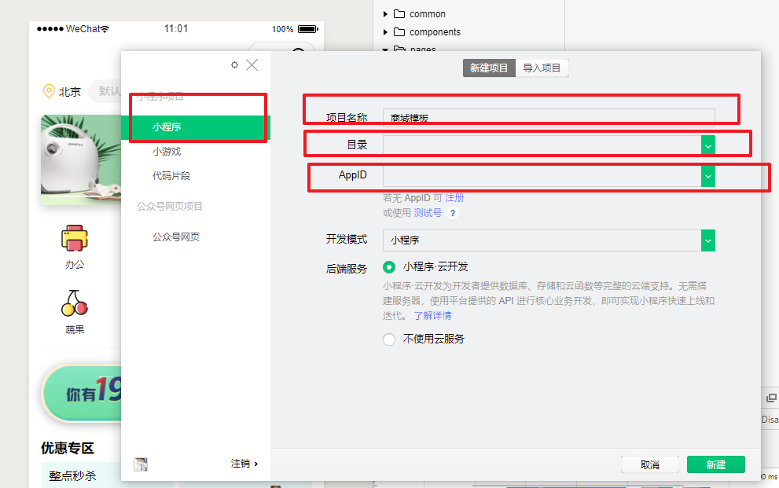


## 2、初始化项目

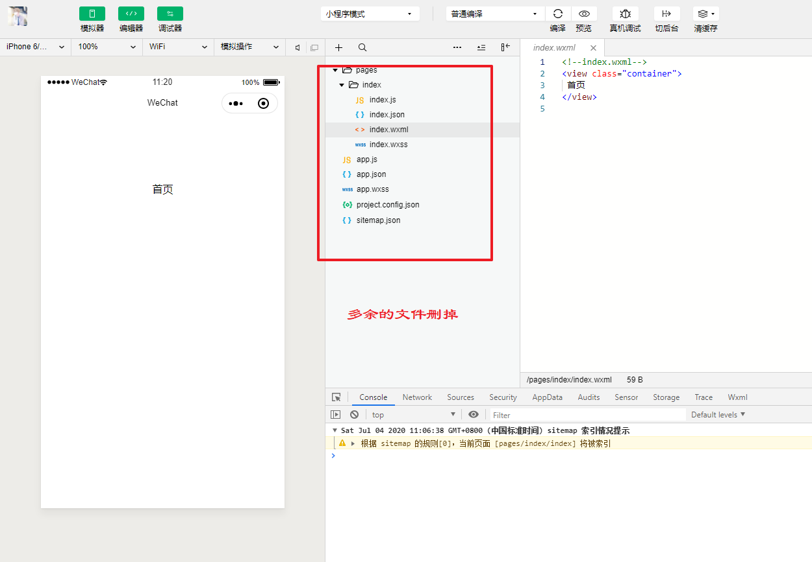


## 3、实现标题以及tabBar底部导航

app.json

```json
{
  "pages": [
    "pages/home/index",
    "pages/category/index",
    "pages/cart/index",
    "pages/user/index",
    "pages/search/index"
  ],
  "window": {
    "navigationBarTitleText": "从0到1实战微信小程序",
    "navigationBarBackgroundColor": "#eb4450",
    "navigationBarTextStyle": "black",
    "backgroundColorTop": "#ffffff",
    "backgroundColorBottom": "#ffffff",
    "backgroundColor": "#ffffff"
  },
  "tabBar": {
    "color": "#333333",
    "selectedColor": "#f06c7a",
    "borderStyle": "black",
    "backgroundColor": "#ffffff",
    "list": [{
        "pagePath": "pages/home/index",
        "iconPath": "static/tabBar/home.png",
        "selectedIconPath": "static/tabBar/home-on.png",
        "text": "首页"
      },
      {
        "pagePath": "pages/category/index",
        "iconPath": "static/tabBar/category.png",
        "selectedIconPath": "static/tabBar/category-on.png",
        "text": "分类"
      },
      {
        "pagePath": "pages/cart/index",
        "iconPath": "static/tabBar/cart.png",
        "selectedIconPath": "static/tabBar/cart-on.png",
        "text": "购物车"
      },
      {
        "pagePath": "pages/user/index",
        "iconPath": "static/tabBar/user.png",
        "selectedIconPath": "static/tabBar/user-on.png",
        "text": "我的"
      }
    ]
  },
  "style": "v2",
  "sitemapLocation": "sitemap.json"
}
```

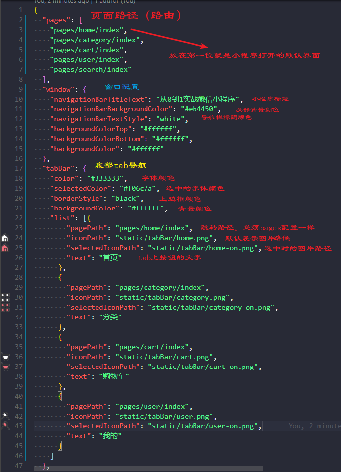


> 便捷操作

在page写入路径保存，自动生成对应文件夹以及对应的 js json wxml wxss。


## 4、实现首页

> 效果图先上


### 4.1、首页功能分析

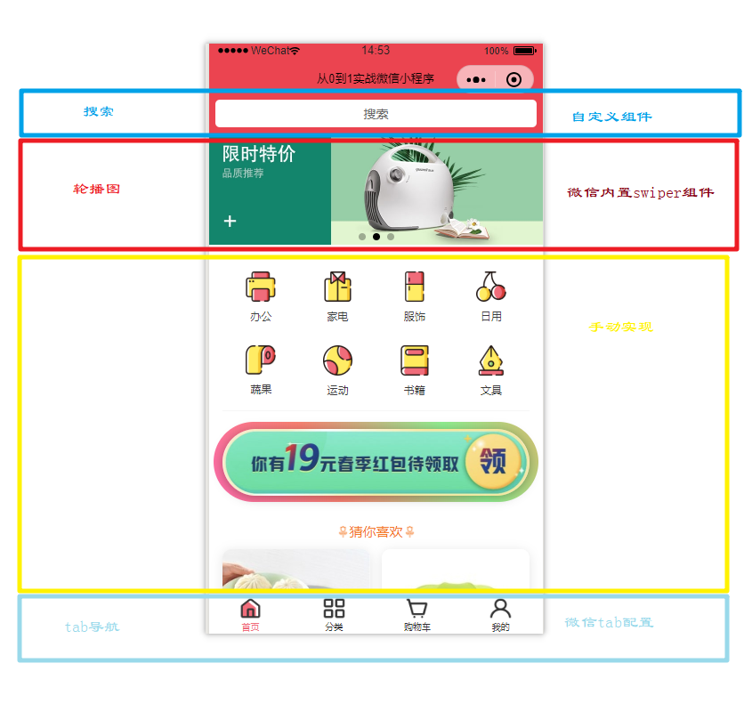

> 代码

```html
<!--pages/home/index.wxml-->
<page class="home">
  <!-- 搜索 -->
  <view class="shop-input">
    <search-input></search-input>
  </view>

  <!-- 轮播图 -->
  <view class="shop-swiper">
    <swiper class="" indicator-dots autoplay interval="5000">
      <block wx:for="{{swiperList}}" wx:key="{{item}}">
        <swiper-item class="" item-id="">
          <image class="" src="{{item.url}}" mode="widthFix" />
        </swiper-item>
      </block>
    </swiper>
  </view>
  <!-- 分类数据 -->
  <view class="category-list">
    <block wx:for="{{categoryList}}" wx:key="{{item.name}}">
      <view class="category" bindtap="hancleClickItem" data-itemList="{{item}}">
        <view class="img">
          <image src="{{item.image_src}}" mode="widthFix" />
        </view>
        <view>
          <view class="text">{{item.name}}</view>
        </view>
      </view>
    </block>
  </view>

  <!-- 广告图 -->
  <view class="banner">
    <MarqueeUp />
    <view class="img-box">
      <image src="https://ae01.alicdn.com/kf/H5470c644e6454719a610620f1e6f67d9y.jpg" />
    </view>
  </view>

  <!-- 楼层数据 -->
  <view class="goods-list">
    <view class="title">
      <image src="https://ae01.alicdn.com/kf/H551edcdd154a4936a5762971504fb3e2r.jpg"></image>
      猜你喜欢
      <image src="https://ae01.alicdn.com/kf/H551edcdd154a4936a5762971504fb3e2r.jpg"></image>
    </view>
    <view class="product-list">
      <block wx:for="{{productList}}" wx:key="{{item}}">
        <view class="product">
          <image src="{{item.img_url}}" />
          <view class="name ellipsis">{{ item.name }}</view>
          <view class="info">
            <view class="price">{{ item.price }}</view>
            <view class="slogan">{{ item.slogan }}</view>
          </view>
        </view>
      </block>
    </view>
  </view>
</page>
```


### 4.2、实现搜索自定义组件

#### 1、微信开发者工具创建自定义组件

根目录创建`components/SearchInput`文件，`SearchInput`右键选择新建Component,自定生成js json wxss wxml

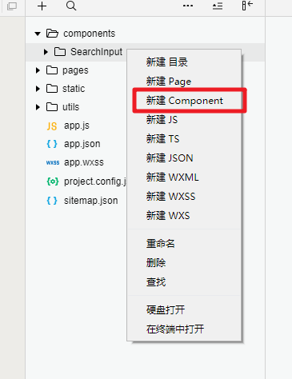


#### 2、代码实现

SearchInput.wxml

```html
<view class="search_row">
  <navigator class="search_input" target="" url="../search/index" hover-class="navigator-hover" open-type="navigate">
    搜索
  </navigator>
</view>
```


SearchInput.wxss

```css
.search_row {
  height: 90rpx;
  padding: 15rpx;
  background-color: #eb4450;
}
.search_row .search_input {
  border-radius: 10rpx;
  background-color: #fff;
  height: 100%;
  display: flex;
  justify-content: center;
  align-items: center;
}

```

#### 引入自定义组件

> 首先要在页面的 `json` 文件中进行引用声明。还要提供对应的组件名和组件路径

```
{
  "usingComponents": {
    "search-input":"/components/SearchInput/SearchInput"
  }
}
```

* usingComponents    引用声明
* search-input   组件名称（`SearchInput  `）
* "/components/SearchInput/SearchInput"   组件路径

#### 页面中使用

```html
<!--pages/home/index.wxml-->
<page class="home">
  <!-- 搜索 -->
  <view class="shop-input">
    <search-input></search-input>
  </view>
</page>
```


#### navigator

> 导航组件 类似超链接标签 

| 属性名    | 类型   | 默认值   | 说明                                                         |
| --------- | ------ | -------- | ------------------------------------------------------------ |
| target    | String | self     | 在哪个目标上发生跳转，默认当前小程序，可选值self（当前小程序）/miniProgram（其他小程序） |
| url       | String |          | 当前小程序内的跳转链接                                       |
| open-type | String | navigate | 跳转方式                                                     |

**open-type 合法值：**

| 值           | 说明                                                         |
| ------------ | ------------------------------------------------------------ |
| navigate     | 保留当前页面，跳转到应用内的某个页面，但是不能跳到 tabbar 页面 |
| redirect     | 关闭当前页面，跳转到应用内的某个页面，但是不允许跳转到 tabbar 页面。 |
| switchTab    | 跳转到 tabBar 页面，并关闭其他所有非 tabBar 页面             |
| reLaunch     | 关闭所有页面，打开到应用内的某个页面                         |
| navigateBack | 关闭当前页面，返回上一页面或多级页面。可通过 `getCurrentPages` 获取当前的页面栈，决定需要返回几层 |
| exit         | 退出小程序，target="miniProgram"时生效                       |

#### 

### 4.3、实现轮播图（swiper）

> 使用微信内置`swiper`组件实现

#### swiper

* 滑块视图容器，
* 默认宽度100%，高度150px;

> 常用属性

| 属性名                 | 类型    | 默认值            | 说明                 |
| ---------------------- | ------- | ----------------- | -------------------- |
| indicator-dots         | Boolean | false             | 是否显示面板指示点   |
| indicator-color        | Color   | rgba(0, 0, 0, .3) | 指示点颜色           |
| indicator-active-color | Color   | #000000           | 当前选中的指示点颜色 |
| autoplay               | Boolean | false             | 是否自动切换         |
| interval               | Number  | 5000              | 自动切换时间间隔     |
| circular               | Boolean | false             | s是否循环轮播        |


#### swiper-item

* 仅可放置在`swiper`组件中，宽高自动设置为100%。

#### image

> 微信内置图片组件，默认宽度320px、高度240px，支持懒加载

**常用属性：**

| 属性名    | 类型    | 默认值        | 说明                 |
| --------- | ------- | ------------- | -------------------- |
| src       | String  |               | 图片资源地址         |
| mode      | String  | 'scaleToFill' | 图片裁剪、缩放的模式 |
| lazy-load | Boolean | false         | 图片懒加载           |

**mode 的合法值**

> 一共有13种模式，9种裁剪模式，4种缩放模式，常用`widthFix`

| 值           | 说明                                                         |
| :----------- | :----------------------------------------------------------- |
| scaleToFill  | 缩放模式，不保持纵横比缩放图片，使图片的宽高完全拉伸至填满 image 元素 |
| aspectFit    | 缩放模式，保持纵横比缩放图片，使图片的长边能完全显示出来。也就是说，可以完整地将图片显示出来。 |
| aspectFill   | 缩放模式，保持纵横比缩放图片，只保证图片的短边能完全显示出来。也就是说，图片通常只在水平或垂直方向是完整的，另一个方向将会发生截取。 |
| widthFix     | 缩放模式，宽度不变，高度自动变化，保持原图宽高比不变         |
| heightFix    | 缩放模式，高度不变，宽度自动变化，保持原图宽高比不变         |
| top          | 裁剪模式，不缩放图片，只显示图片的顶部区域                   |
| bottom       | 裁剪模式，不缩放图片，只显示图片的底部区域                   |
| center       | 裁剪模式，不缩放图片，只显示图片的中间区域                   |
| left         | 裁剪模式，不缩放图片，只显示图片的左边区域                   |
| right        | 裁剪模式，不缩放图片，只显示图片的右边区域                   |
| top left     | 裁剪模式，不缩放图片，只显示图片的左上边区域                 |
| top right    | 裁剪模式，不缩放图片，只显示图片的右上边区域                 |
| bottom left  | 裁剪模式，不缩放图片，只显示图片的左下边区域                 |
| bottom right | 裁剪模式，不缩放图片，只显示图片的右下边区域                 |


#### 代码实现

```html
  <!-- 轮播图 -->
  <view class="shop-swiper">
    <swiper class="" indicator-dots autoplay interval="5000">
      <block wx:for="{{swiperList}}" wx:key="{{item}}">
        <swiper-item class="" item-id="">
          <image  src="{{item.url}}" mode="widthFix" />
        </swiper-item>
      </block>
    </swiper>
  </view>
```


### 4.4、实现分类/广告图/实现楼层

> 手动代码实现，直接贴代码了，主要讲下楼层使用了请求获取数据

```html
<!--pages/home/index.wxml-->
<page class="home">
  <!-- 搜索 -->
  <view class="shop-input">
    <search-input></search-input>
  </view>

  <!-- 轮播图 -->
  <view class="shop-swiper">
    <swiper class="" indicator-dots autoplay interval="5000">
      <block wx:for="{{swiperList}}" wx:key="{{item}}">
        <swiper-item  item-id="">
          <image class="" src="{{item.url}}" mode="widthFix" />
        </swiper-item>
      </block>
    </swiper>
  </view>
  <!-- 分类数据 -->
  <view class="category-list">
    <block wx:for="{{categoryList}}" wx:key="{{item.name}}">
      <view class="category" bindtap="hancleClickItem" data-itemList="{{item}}">
        <view class="img">
          <image src="{{item.image_src}}" mode="widthFix" />
        </view>
        <view>
          <view class="text">{{item.name}}</view>
        </view>
      </view>
    </block>
  </view>

  <!-- 广告图 -->
  <view class="banner">
    <MarqueeUp />
    <view class="img-box">
      <image src="https://ae01.alicdn.com/kf/H5470c644e6454719a610620f1e6f67d9y.jpg" />
    </view>
  </view>

  <!-- 楼层数据 -->
  <view class="goods-list">
    <view class="title">
      <image src="https://ae01.alicdn.com/kf/H551edcdd154a4936a5762971504fb3e2r.jpg"></image>
      猜你喜欢
      <image src="https://ae01.alicdn.com/kf/H551edcdd154a4936a5762971504fb3e2r.jpg"></image>
    </view>
    <view class="product-list">
      <block wx:for="{{productList}}" wx:key="{{item}}">
        <view class="product">
          <image src="{{item.img_url}}" />
          <view class="name ellipsis">{{ item.name }}</view>
          <view class="info">
            <view class="price">{{ item.price }}</view>
            <view class="slogan">{{ item.slogan }}</view>
          </view>
        </view>
      </block>
    </view>
  </view>
</page>
```


```css
/* pages/home/index.wxss */
swiper {
  height: 260rpx;
}

/* 分类 */
.category-list {
  width: 92%;
  margin: 0 4%;
  padding: 0 0 30rpx 0;
  border-bottom: solid 2rpx #f6f6f6;
  display: -webkit-box;
  display: -webkit-flex;
  display: -ms-flexbox;
  display: flex;
  justify-content: space-between;
  flex-wrap: wrap;

}

.category-list .category {
  width: 25%;
  margin-top: 50rpx;
  display: flex;
  flex-wrap: wrap;
  justify-content: center;
}

.category-list .category .img {
  width: 100%;
  display: flex;
  justify-content: center;
}

.category-list .category .img image {
  width: 9vw;
  height: 9vw;
}


.category-list .category .text {
  margin-top: 16rpx;
  width: 100%;
  display: flex;
  justify-content: center;
  font-size: 24rpx;
  color: #3c3c3c;
}

/* 广告图 */
.banner {
  width: 92%;
  margin: 40rpx 4%;
}

.banner .img-box {
  position: relative;
  width: 100%;
  height: 150rpx;
  margin-top: 20rpx;
  border-radius: 80rpx;
}

.banner .img-box::before {
  content: "";
  position: absolute;
  width: calc(100% + 6%);
  height: 180rpx;
  border-radius: 100rpx;
  top: -15rpx;
  left: -3%;
  z-index: -1;
  background-image: linear-gradient(60deg, red, cornflowerblue, yellow, hotpink, salmon, lightgreen, sandybrown, violet);
  background-size: 300%;
  animation: animate_bg 5s infinite;
}

@keyframes animate_bg {

  0%,
  100% {
    background-position: 0%, 50%;
  }

  50% {
    background-position: 100%, 50%;
  }
}

.banner image {
  width: 100%;
  height: 20vw;
  border-radius: 10vw;
  box-shadow: 0rpx 5rpx 25rpx rgba(0, 0, 0, 0.3);
}

/* 楼层 */
.goods-list{
  width: 100%;
}
.goods-list .title {
  width: 100%;
  margin-top: 10rpx;
  display: flex;
  justify-content: center;
  align-items: center;
  height: 80rpx;
  color: #f47825;
  font-size: 30rpx;
}

.goods-list .title image {
  width: 30rpx;
  height: 30rpx;
}

.goods-list .product-list {
  width: 100%;
  padding: 0 4% 3vw 4%;
  display: flex;
  justify-content: space-between;
  flex-wrap: wrap;

}

.product {
  width: 48%;
  border-radius: 20rpx;
  background-color: #fff;
  margin: 0 0 15rpx 0;
  box-shadow: 0rpx 5rpx 25rpx rgba(0, 0, 0, 0.1);

}

.product image {
  width: 100%;
  height: 332rpx;
  border-radius: 20rpx 20rpx 0 0;
}

.product .name {
  width: 92%;
  padding: 10rpx 4%;
  font-size: 30rpx;
}

.product .info {
  display: flex;
  justify-content: space-between;
  align-items: flex-end;
  width: 92%;
  padding: 10rpx 4% 10rpx 4%;
}

.product .info .price {
  color: #e65339;
  font-size: 30rpx;
  font-weight: 600;
}

.product .info .slogan {
  color: #807c87;
  font-size: 24rpx;
}
```


### wx.request获取后端数据

> 发起 HTTPS 网络请求,具体请参阅微信文档

##### **request + promise封装**


```js
class request {
  constructor() {
    this._baseUrl = 'https://www.fastmock.site/mock/31875da47f27128e357e3d3e6ac0cc37/api/';
    this._token = wx.getStorageSync('token');
    // this._header = {'Authorization': 'Bearer ' + token}
  }

  /**
   * GET类型的网络请求
   */
  getRequest(url, data, header = this._header) {
    return this.requestAll(url, data, header, 'GET')
  }

  /**
   * DELETE类型的网络请求
   */
  deleteRequest(url, data, header = this._header) {
    return this.requestAll(url, data, header, 'DELETE')
  }

  /**
   * PUT类型的网络请求
   */
  putRequest(url, data, header = this._header) {
    return this.requestAll(url, data, header, 'PUT')
  }

  /**
   * POST类型的网络请求
   */
  postRequest(url, data, header = this._header) {
    return this.requestAll(url, data, header, 'POST')
  }

  /**
   * 网络请求
   */
  requestAll(url, data, header, method) {
    return new Promise((resolve, reject) => {
      // 显示正在等待
      wx.showLoading({
        title: "正在加载中",
        mask: false
      });
      wx.request({
        url: this._baseUrl + url,
        data: data,
        header: header,
        method: method,
        success: (res => {
          let {
            data
          } = res;
          // console.log(res);
          if (data.success && data.code == 200) {
            //200: 服务端业务处理正常结束
            resolve(data.data)
          } else {
            //其它错误，提示用户错误信息
            reject(data.data)
          }
        }),
        fail: (res => {
          reject(res)
        }),
        complete: () => {
          // 隐藏正在等待图标
          wx.hideLoading();
        }
      })
    })
  }
}

export default request
```

##### 页面使用request

```js
import request from '../../utils/request';  //引入
const api = new request(); //创建实例
```

##### 使用方法

* Get请求-----------------  api.getRequest(`接口路径`,`入参(对象)`)
* Post请求---------------- api.postRequest(  'home/getProductList',*this*.QueryParams )
* .....

> **注意：** 开发过程中需要勾选`不校验合法域名、web-view业务域名`等，生产上线登录小程序官方配置对应域名，不然无法发起请求。

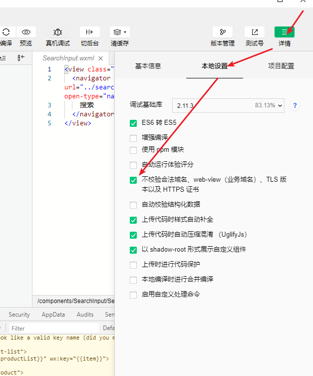


### 4.5 动态获取楼层数据

```js

import request from '../../utils/request';
const api = new request();
Page({

  /**
   * 页面的初始数据
   */
  data: {
    swiperList: [{
        id: 1,
        url: 'https://ae01.alicdn.com/kf/H9450011bbd2e480882aa986c8ceaa312i.jpg'
      },
      {
        id: 2,
        url: 'https://ae01.alicdn.com/kf/H1eeb66ae770b44ad9147c1123fb63a32P.jpg'
      },
      {
        id: 3,
        url: 'https://ae01.alicdn.com/kf/H0fdf0f299c2a49d5995582f085d24522G.jpg'
      },
    ],
    // 分类菜单
    categoryList: [{
        id: 1,
        "name": "办公",
        image_src: 'https://ae01.alicdn.com/kf/H974e4de8124b4783b7768d06a2b847ab0.jpg'
      },
      {
        id: 2,
        "name": "家电",
        image_src: 'https://ae01.alicdn.com/kf/H53dede49e8bd4037b702eeb1f83f1b55M.jpg'
      },
      {
        id: 3,
        "name": "服饰",
        image_src: 'https://ae01.alicdn.com/kf/H575960420d6b4990960160fba79f443bw.jpg'
      },
      {
        id: 4,
        "name": "日用",
        image_src: 'https://ae01.alicdn.com/kf/H30b911d8668d46deb9cfed0fd68da1fex.jpg'
      },
      {
        id: 5,
        "name": "蔬果",
        image_src: 'https://ae01.alicdn.com/kf/Hd3edad8b6c834a23aa214fa83ecca4ddm.jpg'
      },
      {
        id: 6,
        "name": "运动",
        image_src: 'https://ae01.alicdn.com/kf/Hdb7bb002f13c4b79bc876c28555ca7ceV.jpg'
      },
      {
        id: 7,
        "name": "书籍",
        image_src: 'https://ae01.alicdn.com/kf/Hc1a477b73bc147728ef29ab6c74af0f0O.jpg'
      },
      {
        id: 8,
        "name": "文具",
        image_src: 'https://ae01.alicdn.com/kf/H23940f3a1f3145418b439c32521e263b4.jpg'
      }
    ],
    //猜你喜欢列表
    productList: [],
  },
  // 定义接口参数对象 
  QueryParams: {
    // 页码
    pagenum: 1,
    // 页容量
    pagesize: 10
  },
  // 总页码
  totalPage: 1,

  // 获取商品列表
  getProductList() {
    // 使用微信小程序内置发送请求的代码来获取数据
    api.postRequest(
      'home/getProductList',
      this.QueryParams
    ).then(res => {
      console.log(res);
      // 执行加载下一页的时候 productList 应该是 叠加 
      // 拼接数组 
      let productList = [...this.data.productList, ...res.productList];
      this.setData({
        productList
      });

      // 计算总页码
      this.totalPage = Math.ceil(res.total / this.QueryParams.pagesize);
    })
  },
  // 点击分类事件
  hancleClickItem(e) {
    let data = e.currentTarget.dataset.itemlist;
    wx.showToast({
      title: '点击了' + data.name,
      icon: 'none'
    })
  },
  /**
   * 生命周期函数--监听页面加载
   */
  onLoad: function (options) {

  },

  /**
   * 生命周期函数--监听页面初次渲染完成
   */
  onReady: function () {

    this.getProductList()
  },

  /**
   * 生命周期函数--监听页面显示
   */
  onShow: function () {

  },

  /**
   * 生命周期函数--监听页面隐藏
   */
  onHide: function () {

  },

  /**
   * 生命周期函数--监听页面卸载
   */
  onUnload: function () {

  },

  /**
   * 页面相关事件处理函数--监听用户下拉动作
   */
  onPullDownRefresh: function () {
    // wx.showNavigationBarLoading() //在标题栏中显示加载
    this.QueryParams.pagenum = 1;
    this.setData({
      productList: []
    });
    this.getProductList();
    //  结束下拉刷新组件的显示
    wx.stopPullDownRefresh();
  },

  /**
   * 页面上拉触底事件的处理函数
   */
  onReachBottom: function () {
    // 判断有没有下一页数据
    if (this.QueryParams.pagenum >= this.totalPage) {
      // 没有数据
      wx.showToast({
        title: '没有更多数据了',
        icon: 'none',
        duration: 1500,
        // 蒙版  遮罩层 
        mask: false
      });

    } else {
      this.QueryParams.pagenum++;
      this.getProductList();
    }
  },

  /**
   * 用户点击右上角分享
   */
  onShareAppMessage: function () {

  }
})
```


### 4.6 实现下拉刷新上啦加载更多

> 首页开启下拉刷新

（1)、在index.json 中开启下拉刷新，需要设置backgroundColor，或者是backgroundTextStyle ，因为加载的动画可能会是白色背景，会看不清。

```js
{
  "enablePullDownRefresh": true,
  "onReachBottomDistance": 50,
  "usingComponents": {
    "search-input":"/components/SearchInput/SearchInput"
  }
}
```

(2)、在`onPullDownRefresh` 函数中监听下拉事件，执行刷新方法

```js
  /**
   * 页面相关事件处理函数--监听用户下拉动作
   */
  onPullDownRefresh: function () {
    // wx.showNavigationBarLoading() //在标题栏中显示加载
    this.QueryParams.pagenum = 1;
    this.setData({
      productList: []
    });
    this.getProductList();
    //  结束下拉刷新组件的显示
    wx.stopPullDownRefresh();
  },
```


> 开启上拉加载更多

直接监听 `onReachBottom`事件，实现加载更多

```js
/**
   * 页面上拉触底事件的处理函数
   */
  onReachBottom: function () {
    // 判断有没有下一页数据
    if (this.QueryParams.pagenum >= this.totalPage) {
      // 没有数据
      wx.showToast({
        title: '没有更多数据了',
        icon: 'none',
        duration: 1500,
        // 蒙版  遮罩层 
        mask: false
      });

    } else {
      this.QueryParams.pagenum++;
      this.getProductList();
    }
  },
```


## 5、实现分类界面

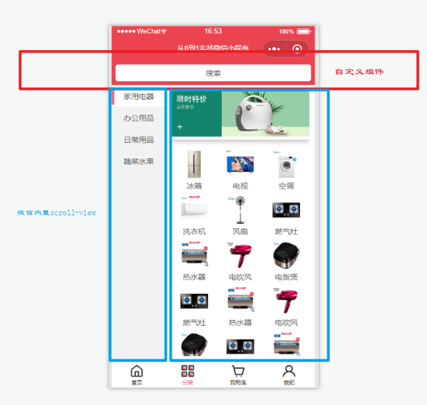

> 分类界面比较简单，顶部搜索直接用之前的搜索组件，主要讲一下`scroll-view`

### scroll-view组件

> 可滚动视图区域。使用竖向滚动时，需要给`scroll-view`一个固定高度，通过 WXSS 设置 height。组件属性的长度单位默认为px，2.4.0 起支持传入单位(rpx/px)。

| 属性            | 类型          | 默认值 | 必填 | 说明                                       |
| --------------- | ------------- | ------ | ---- | ------------------------------------------ |
| scroll-x        | boolean       | false  | 否   | 设置横向滚动                               |
| scroll-y        | boolean       | false  | 否   | 设置纵向滚动                               |
| upper-threshold | number/string | 50     | 否   | 距顶部/左边多远时，触发 scrolltoupper 事件 |
| lower-threshold | number/string | 50     | 否   | 距底部/右边多远时，触发 scrolltolower 事件 |
| scroll-top      | number/string | -      | 否   | 设置竖向滚动条位置（可以实现锚点定位）     |
|                 |               |        |      |                                            |
|                 |               |        |      |                                            |

## 6、实现商品详情页


### 小程序使用阿里巴巴矢量图

> 1、[阿里巴巴矢量图官网](<https://www.iconfont.cn/home/index?spm=a313x.7781069.1998910419.2>)找到需要的图标,添加到项目。

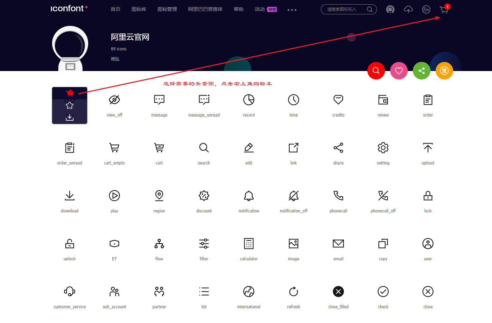

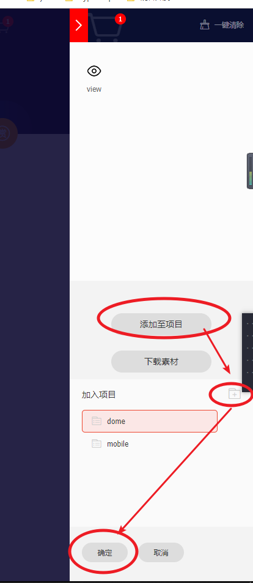


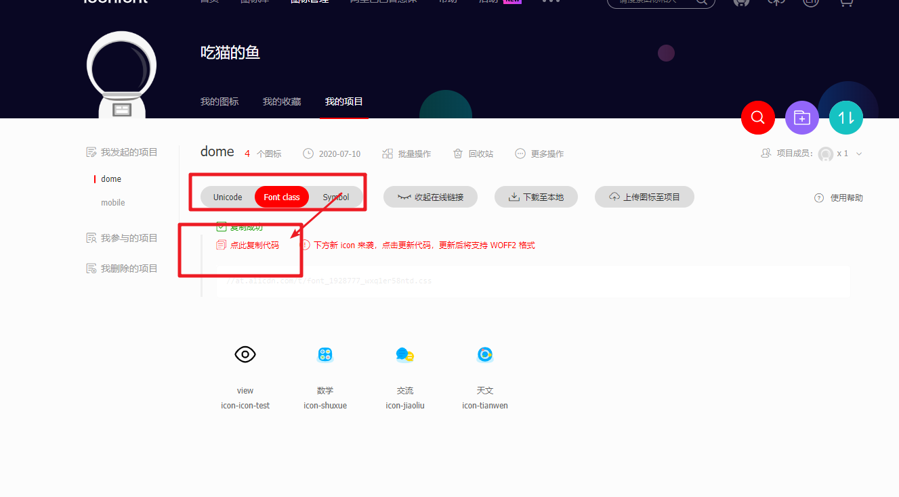


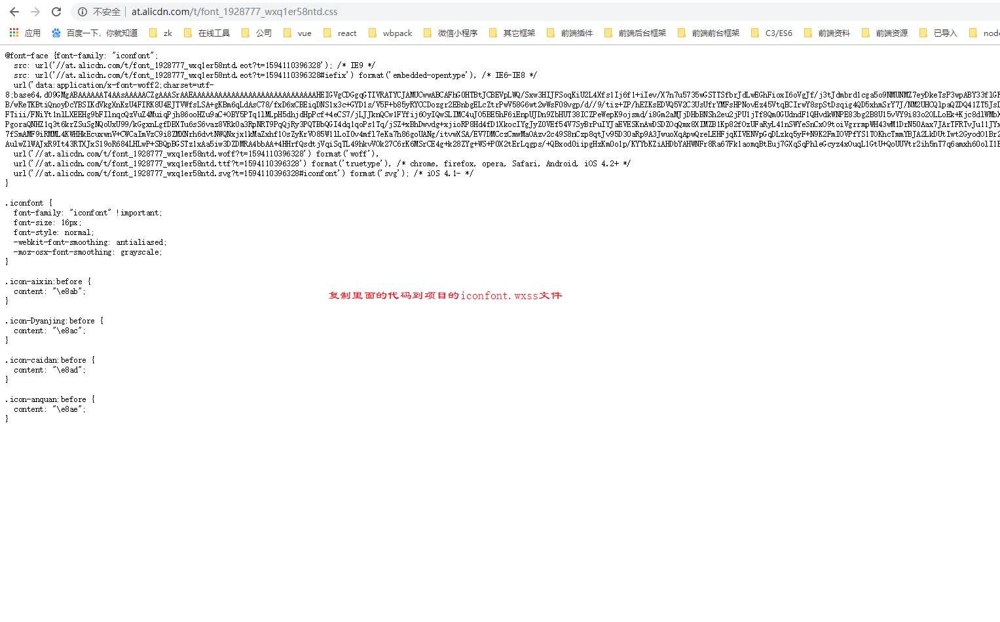

> 最后在`app.wxss` 引入

```css
/*  阿里矢量图地址 */
@import "/styles/iconfont.wxss";

page,
view,
text,
textarea,
swiper,
swiper-item,
navigator,
image {
  margin: 0;
  padding: 0;
  box-sizing: border-box;
  font-size: 28rpx;

}

page {
  color: #666;
}

image {
  width: 100%;
}
```

* 引入需要使用`@import`
* 使用绝对路径，不要使用`./`相对路径

> 页面使用

```html
   <!-- 
      iconfont  必须的 
	  icon-arrow-righ    图标的类名（在iconfont.wxss中可以找到）
	-->
<text class="iconfont icon-arrow-right"></text>
```


### 6.1、首页商品带参数跳转详情页

```html
<!-- pages/home/index.wxml -->
<view class="product-list">
      <block wx:for="{{productList}}" wx:key="{{item}}">
        <navigator class="product" url="../goods_detail/index?goods_id={{item.goods_id}}">
          <!-- <view class="product"> -->
          <image src="{{item.img_url}}" mode="widthFix" lazy-load='true' />
          <view class="name ellipsis">{{ item.name }}</view>
          <view class="info">
            <view class="price">{{ item.price }}</view>
            <view class="slogan">{{ item.slogan }}</view>
          </view>
          <!-- </view> -->
        </navigator>
      </block>
    </view>
```

**运用`navigator`跳转**：

* ../goods_detail/index    跳转的相对路径；
* ?goods_id={{item.goods_id}}   动态 传参数，

#### 小程序获取url上面的参数

* onLoad 自带一个 **options**入参 通过 `options.goods_id `获取

```js
// pages/goods_detail/index.js
  /**
   * 页面的初始数据
   */
  data: { },

  /**
   * 生命周期函数--监听页面加载
   */
  onLoad: function (options) {
    // console.log(options)
    //获取url传递的参数
    let goods_id = options.goods_id
  },

```

### 

### 6.2、获取详情数据并动态设置界面标题

> 调用之前封装好的 `request` 获取数据

```js
// pages/goods_detail/index.js
import request from '../../utils/request';
const api = new request();
Page({

  /**
   * 页面的初始数据
   */
  data: {
    // 轮播图
    swiperList: [],
    // 楼层图
    descriptionImgs: [],
    // 服务
    services: [],
    // 规格
    spec: [],
    // 评论
    comment: null,
  },
  //缓存接口的数据
  goodsData: null,
  // 获取商品详情
  getGoodsDetail(goods_id) {
    api.postRequest(
      'getGoodsDetail', {
        goods_id
      }
    ).then(res => {
      console.log(res);
      this.goodsData = res.goodsDetail
      let {
        swiperList,
        descriptionImgs,
        comment,
        services,
        spec
      } = this.goodsData;
      this.setData({
        swiperList,
        descriptionImgs,
        comment,
        services,
        spec,
      });
      console.log(this.data);
      //动态设置标题
      wx.setNavigationBarTitle({
        title: this.goodsData.name
      })

    })
  },
  /**
   * 生命周期函数--监听页面加载
   */
  onLoad: function (options) {
    // console.log(options)
    //获取url传递的参数
    let goods_id = options.goods_id
    this.getGoodsDetail(goods_id)
  },
})
```

> **小程序设置界面标题的两种方式**

* 1、写死的方式（在json直接配置：） 

  ```json
  {
   
    "navigationBarTitleText": "标题"
   
  }
  ```

  

* 2、动态修改的形式

  ```js
  onLoad: function (options) {
       //动态设置标题
      wx.setNavigationBarTitle({
          title: this.goodsData.name
        })
    }6.3、swiper 实现轮播图
  ```


### 6.3、swiper实现轮播图

> 上面已经调用接口获取到所有数据，所以直接使用上一节用到的`swiper`

```html
 <!-- 轮播图 -->
  <view class="goods-swiper">
    <swiper class="" indicator-dots autoplay interval="5000">
      <block wx:for="{{swiperList}}" wx:key="{{item.id}}">
        <swiper-item item-id="">
          <image class="" src="{{item.img}}" mode="widthFix" />
        </swiper-item>
      </block>
    </swiper>
  </view>
```

